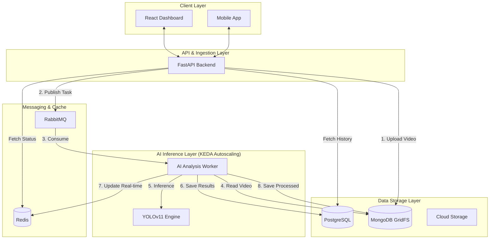
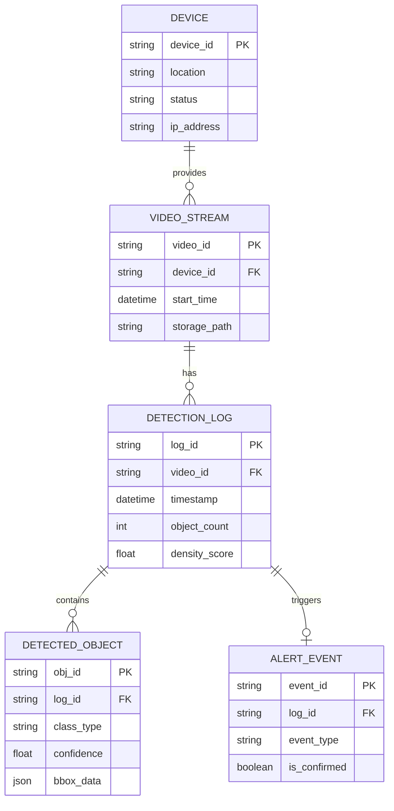

# CAPS: Cloud-AI Pedestrian Safety Analysis Platform

이 프로젝트는 최신 SOTA AI를 활용한 보행자 안전 분석 및 통합 관제 플랫폼입니다.

## 🌟 프로젝트 개요
**CAPS (Cloud-AI Pedestrian Safety Analysis Platform)**는 최신 객체 탐지 알고리즘(YOLOv11 등)과 클라우드 네이티브 인프라를 결합하여 복잡한 도심 환경에서 보행자 안전을 실시간으로 분석하고 다중 밀집 사고를 예방하는 솔루션입니다.

## 🚀 핵심 기능
- **AI 영상 분석 엔진**: YOLOv7, v10, v11, v26 등 최신 알고리즘을 통한 실시간 객체 식별 및 인파 밀집도 분석
- **실시간 위험 탐지**: 무단횡단, 특정 구역 과밀집 등 정의된 위험 시나리오 자동 감지 및 알림
- **개인정보 보호**: 탐지된 안면 및 차량 번호판 실시간 가명 처리 (Blur/Masking)
- **통합 모니터링 대시보드**: 객체별 통계, 서버 상태, 오토스케일링 현황 시각화
- **이벤트 기반 확장성**: RabbitMQ와 KEDA를 활용한 트래픽 기반 GPU 자원 자동 확장 (Autoscaling)
- **Open API 게이트웨이**: 외부 긴급구조 시스템(119 등) 연동을 위한 전용 API (v1) 제공
- **V2X 차량 연동**: 자율주행 차량을 위한 PSM 표준 규격 메시지 실시간 송출
- **멀티테넌트 지원**: 기관별 독립적인 데이터 관리 및 필터링 체계 구축
- **보안 및 개인정보 보호**: 실시간 비식별화 기술 및 엄격한 환경변수 기반 설정 관리
- **Open API 게이트웨이**: 외부 긴급구조 시스템(119 등) 연동을 위한 전용 API (v1) 제공
- **V2X 차량 연동**: 자율주행 차량을 위한 PSM 표준 규격 메시지 실시간 송출
- **멀티테넌트 지원**: 기관별 독립적인 데이터 관리 및 필터링 체계 구축

## 📄 제품 요구사항 정의 (PRD)

### 핵심 가치
최신 AI 기술과 클라우드 인프라를 결합하여 복잡한 도심 환경에서의 **보행자 안전을 실시간으로 확보**하고 사고를 예방하는 지능형 관제 솔루션을 지향합니다.

### 주요 기능 요건
1.  **실시간 정밀 탐지**: YOLOv11 기반 고속 객체 탐지 및 밀집도 분석
2.  **개인정보 비식별화**: 탐지 객체(안면, 번호판)에 대한 실시간 가명처리(Blur/Masking)
3.  **지능형 알림**: 밀집도 임계치 초과 시 즉각적인 위험 이벤트 생성 및 전송
4.  **클라우드 최적화**: KEDA를 통한 워크로드 기반 GPU 오토스케일링

## 🏗 시스템 아키텍처 (System Architecture)

본 플랫폼은 고가용성과 실시간 처리를 위해 **이벤트 기반 마이크로서비스 아키텍처(EDA)**를 채택하고 있습니다.



## 📊 데이터베이스 설계 (ERD)

시스템의 정합성 유지와 대규모 분석 로그 관리를 위한 관계형 데이터 설계 모델입니다.




## 🛠 시스템 구성 및 기술 스택
- **Frontend**: React, Vite, D3.js, Plotly, Tailwind CSS
- **Backend**: FastAPI (Python)
- **Inference**: NVIDIA TensorRT, Managed AI Services (SageMaker/Vertex AI)
- **Data & Messaging**:
  - **PostgreSQL**: 장치 및 마스터 데이터 관리
  - **MongoDB**: AI 탐지 로그 데이터 저장
  - **Redis**: 실시간 데이터 캐싱
  - **RabbitMQ**: 비동기 이벤트 메시징 및 버퍼링
  - **Flink**: 실시간 데이터 스트림 처리
- **Infrastructure**: Docker, Kubernetes, KEDA, GCS FUSE

## 📁 프로젝트 구조
```text
.
├── backend/            # FastAPI 기반 API 서버
├── frontend/           # React 기반 대시보드 웹 서비스
├── docu/               # 프로젝트 정의서, 계획서 및 설계 문서
├── docker-compose.yml  # 로컬 개발 환경 구성
└── README.md           # 프로젝트 개요 및 실행 가이드
```

## 📋 상세 상세정보 및 문서
프로젝트의 상세한 설계와 추진 계획은 아래 문서들을 참고해 주세요.

- [**요구사항 정의 (PRD)**](docu/prd_1.md): 프로젝트 목표, 주요 기능 및 기술 요구사항
- [**수행 계획서 (Plan)**](docu/plan.md): 단계별 일정, 산출물 및 품질 관리 전략
- [**화면 설계서 (UI Design)**](docu/ui_design_1.md): 대시보드 및 모바일 UI 구성 설명
- [**구현 계획 (Implementation)**](docu/implementation_plan.md): 아키텍처 및 상세 구현 로드맵

## 🚀 시작하기 (How to Run)

### 1. 사전 준비 (Prerequisites)
- Docker 및 Docker Compose
- **환경 변수 설정**: 보안과 유연한 설정을 위해 `.env` 파일을 사용합니다.
  - 제공된 `.env.example` 파일을 `.env`로 복사합니다.
  - `.env` 파일 내 각 항목(DB URL, MQ URL 등)을 사용자 환경에 맞게 수정합니다.
  ```bash
  cp .env.example .env
  ```

### 2. 서비스 실행
루트 디렉토리에서 아래 명령어를 실행하여 전체 시스템(DB, MQ, Backend, Frontend)을 구동합니다:
```bash
docker-compose up --build
```

### 3. 접속 정보
- **Frontend (대시보드)**: [http://localhost:5173](http://localhost:5173)
- **Backend API**: [http://localhost:5000](http://localhost:5000)
- **API 문서 (Swagger UI)**: [http://localhost:5000/docs](http://localhost:5000/docs)
- **RabbitMQ 관리 UI**: [http://localhost:15672](http://localhost:15672) (ID: guest / PW: guest)
- **Flink Dashboard**: [http://localhost:8081](http://localhost:8081)

## 📖 API 상세 문서
전체 API 명세는 Swagger(OpenAPI 3.0) 규격을 따르며, 아래 경로에서 확인하실 수 있습니다.

- **실시간 문서**: 서버 구동 후 [http://localhost:5000/docs](http://localhost:5000/docs) 접속
- **정적 명세 파일**: [docu/swagger.yaml](docu/swagger.yaml)
