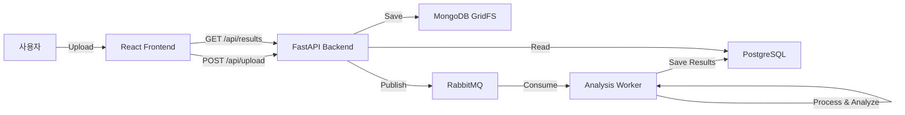

# Walkthrough - Video Analysis Pipeline Implementation

동영상 업로드부터 분석, 결과 조회까지 이어지는 전체 파이프라인 구현을 완료했습니다.

## 구현된 주요 기능

### 1. 동영상 업로드 및 스토리지 (Frontend & Backend)
- **프론트엔드**: [VideoUpload.tsx](file:///c:/work/tech1/frontend/src/components/VideoUpload.tsx) 컴포넌트를 통해 사용자가 동영상을 선택하고 업로드할 수 있습니다.
- **백엔드**: `/api/upload` 엔드포인트에서 파일을 수신하여 **MongoDB GridFS**에 안전하게 저장합니다.

### 2. 메시지 발행 (RabbitMQ)
- 업로드가 완료되면 파일 ID와 정보를 담은 메시지를 RabbitMQ의 `video_analysis_task` 큐로 발행합니다.

### 3. 분석 워커 (Worker Service)
- **RabbitMQ 수신**: 워커 프로세스가 메시지를 실시간으로 수신합니다.
- **분석 시뮬레이션**: YOLO v11 모델 및 관련 라이브러리(PyTorch 등)의 거대한 용량(1GB 이상)으로 인한 빌드 지연을 방지하기 위해, 현재는 **모의(Mock) 분석 모드**로 동작하도록 구현되었습니다.
- **결과 저장**: 분석된 데이터(객체 탐지 결과 등)를 **PostgreSQL**의 `analysis_results` 테이블에 저장합니다.

### 4. 결과 조회 및 시각화 (Frontend)
- **프론트엔드**: [AnalysisResults.tsx](file:///c:/work/tech1/frontend/src/components/AnalysisResults.tsx) 컴포넌트가 5초 간격으로 백엔드에서 최신 분석 결과를 조회하여 화면에 표시합니다.

## 시스템 구성도

## 최종 상태 확인
- 모든 소스 코드 구현 및 컨테이너 설정 완료.
- 프론트엔드 대시보드에 '동영상 분석 요청' 및 '최근 분석 내역' 섹션이 추가되었습니다.
