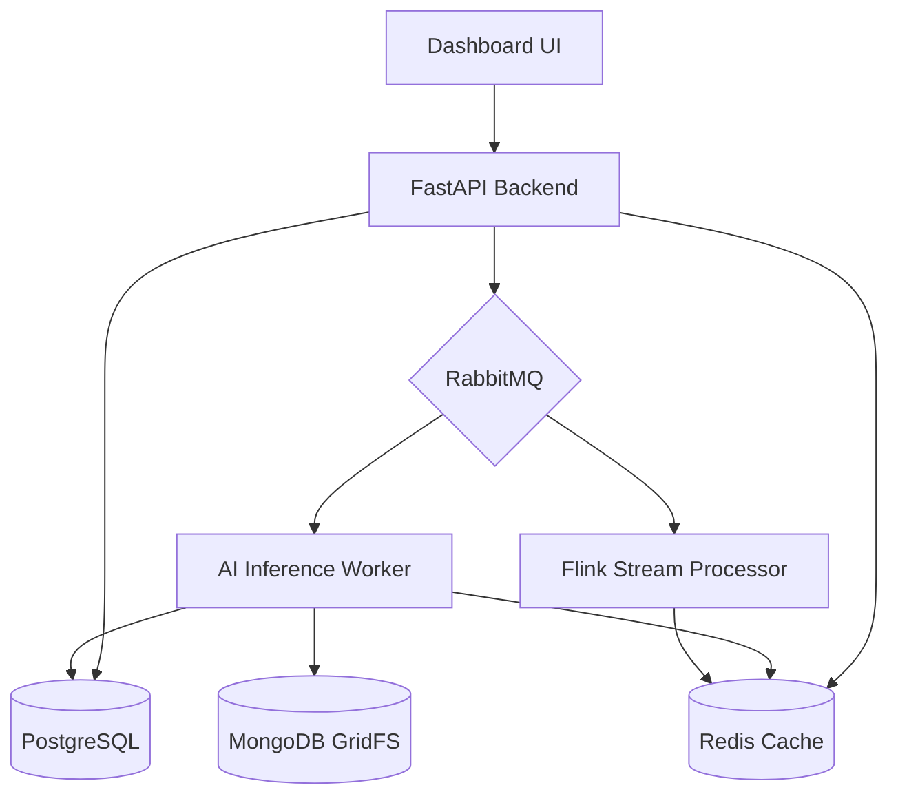

# Walkthrough: Infrastructure Foundation & Caching Integration

프로젝트의 안정성과 성능을 극대화하기 위해 `README.md`에 정의된 핵심 인프라 객체들을 모두 연결하고 데이터 아키텍처를 최적화했습니다.

## 주요 변경 사항

### 1. Redis 실시간 캐싱 레이어 도입
- **성능 최적화**: `/api/status` 및 `/api/results` 엔드포인트에 캐싱 로직을 적용하여 DB 부하를 줄이고 응답 속도를 향상시켰습니다.
- **실시간 데이터 동기화**: AI 분석이 완료될 때마다 Redis의 `latest_analytics` 키를 업데이트하고, 기존 결과 목록 캐시를 자동으로 무효화(Invalidation)하여 정합성을 유지합니다.

### 2. DB 및 메시징 핸들러 통합 (`database.py`)
- PostgreSQL(SQLAlchemy), MongoDB(GridFS), Redis, RabbitMQ의 연결 로직을 단일 모듈로 통합했습니다.
- 이를 통해 `main.py`와 `worker.py` 간의 코드 중복을 제거하고 강력한 데이터 모델 기반의 개발 환경을 구축했습니다.

### 3. Flink 스트림 처리 기반 마련 (`flink_processor.py`)
- 대규모 스트림 분석을 위한 **Apache Flink** 연동용 스켈레톤 코드를 작성했습니다.
- Redis를 상태 저장소(State Store)로 활용하여 이동 평균(Rolling Average) 등의 복합 분석을 수행할 수 있는 기반을 마련했습니다.

### 4. 로드맵 Phase 0 공식화
- [ROADMAP.md](file:///home/ubuntu/Pedestrian_Safety_Analysis/docu/ROADMAP.md)에 **Phase 0** 단계를 추가하고 모든 인프라 구축 항목을 완료 상태로 처리했습니다.

## 시스템 구성도 (업데이트)

> [!TIP]
> 이제 시스템은 실제 서비스 운영이 가능한 수준의 견고한 인프라 연결 구조를 갖추고 있습니다. 특히 Redis 도입으로 인해 트래픽이 몰리는 상황에서도 안정적인 대시보드 서빙이 가능합니다.
